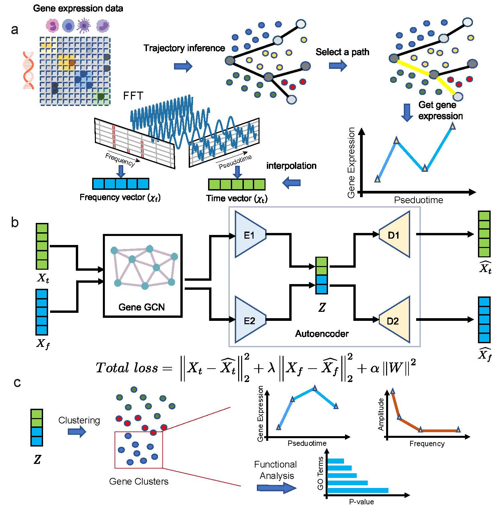
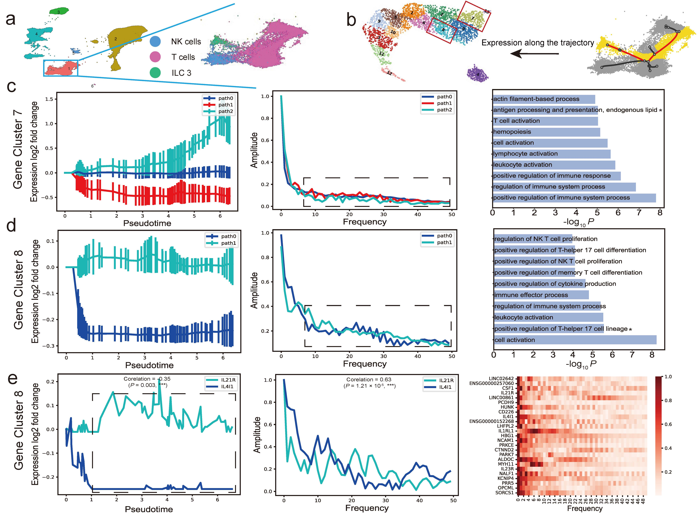
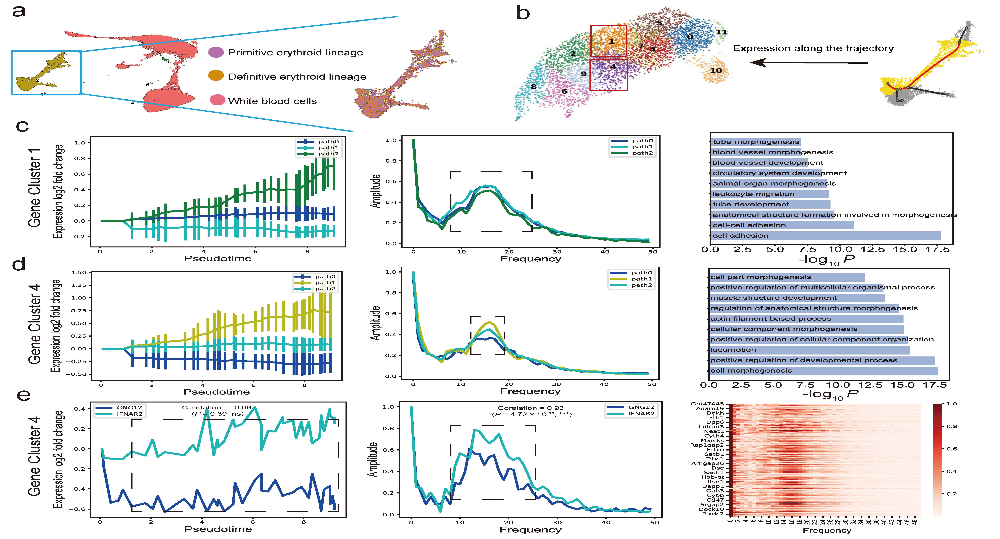
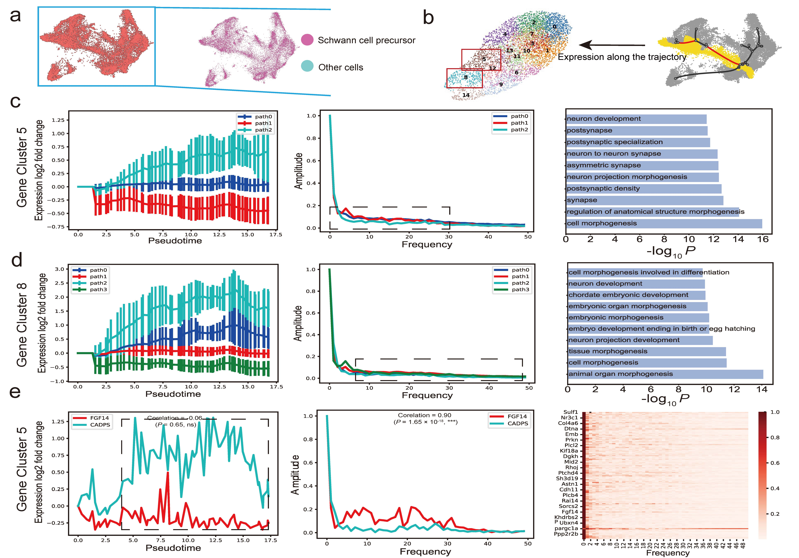
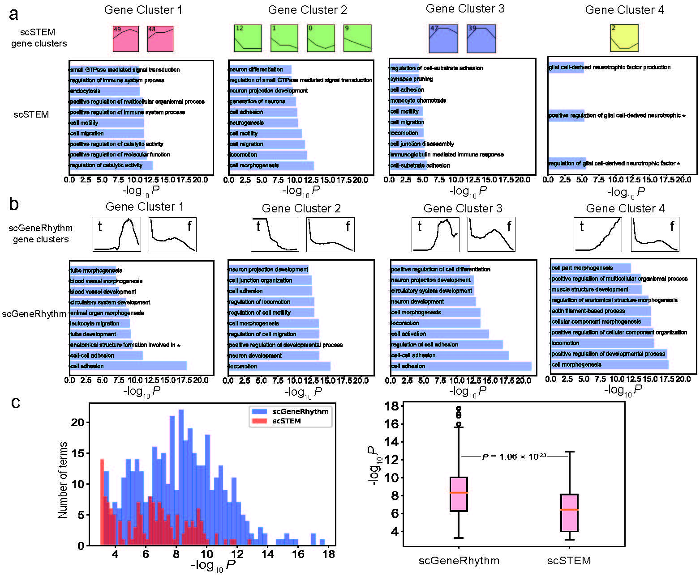
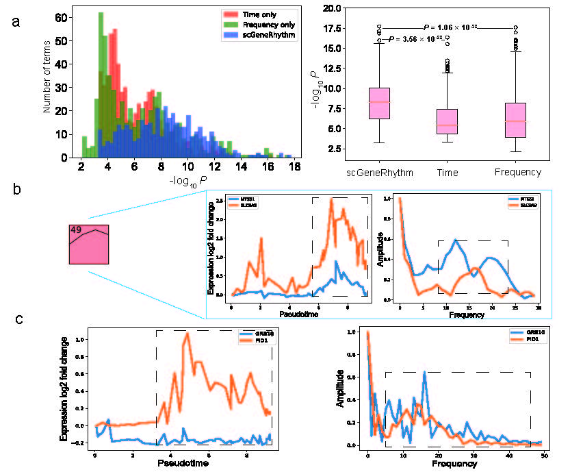

# Getting Started
## 1. Introduction
scGeneRhythm is an innovative tool designed for single-cell RNA sequencing (scRNA-seq) analysis. It utilizes deep learning techniques and Fourier transformation to examine gene expression data, aiming to reveal gene relationships and provide valuable biological insights.
<figure>
  
  <figcaption>Overview of scGeneRythm. a. The flowchart of scGeneRythm. Colored solid circles represent cells mapped to different key segments of a trajectory tree. Average of gene expressions are performed for each key segment. The subsequent step involved obtaining the green-line frame representing the time vector through the calculation of differences, followed by utilizing the Fast Fourier Transform (FFT) to obtain the blue-line frame representing the frequency vector. b. The structure of the machine learning model comprises Graph Convolutional Networks (GCN) along with separate encoders and decoders designed to handle temporal and frequency information. c. For gene embedding clustering and subsequent analysis, including Gene Ontology (GO) terms analysis. This will identify different time and frequency pattern of each gene clusters.</figcaption>
</figure>

### Key Features and Functions

- **Comprehensive Analysis:** GeneRhythm conducts simultaneous analyses in both the time and frequency domains, offering a more holistic perspective.

- **Uncovering Hidden Relationships:** This tool helps identify genes that may appear distinct in the time domain but exhibit similarities in the frequency domain.

- **Outstanding Performance:** scGeneRhythm has demonstrated exceptional performance in gene clustering and pathway enrichment analysis across various single-cell datasets.

- **In-Depth Gene Rhythmicity:** scGeneRhythm assists in uncovering gene rhythmicity and hidden associations, contributing to advancements in cellular and molecular biology research.

## 2. How to use

---

### Setting Up R Environment

R is a powerful programming language and environment for statistical computing and graphics. This guide will walk you through the process of downloading and setting up an R environment on your system.

### Step 1: Download R

1. Visit the official R Project website at [https://www.r-project.org/](https://www.r-project.org/).

2. Click on the "Download R" link located at the top of the page.

3. Choose a CRAN (Comprehensive R Archive Network) mirror site near your location. Select the mirror site that is most appropriate for your region.

4. Download the R distribution for your operating system (Windows, macOS, or Linux). Follow the installation instructions provided on the website for your specific platform.

### Step 2: Install R

Follow the installation instructions for your operating system:

- **Windows**: Double-click the downloaded installer and follow the on-screen instructions.

- **macOS**: Double-click the downloaded package file and follow the installation prompts.

- **Linux**: Install R using your distribution's package manager. For example, on Ubuntu, you can use the following commands in the terminal:

   ```
   sudo apt update
   sudo apt install r-base
   ```

### Step 3: Download an Integrated Development Environment (IDE) (Optional)

While R can be used from the command line, you may find it helpful to use an integrated development environment (IDE) to enhance your productivity. Two popular options are:

- **RStudio**: Download RStudio from [https://www.rstudio.com/](https://www.rstudio.com/). It provides a user-friendly interface and many useful features for R programming.

- **Visual Studio Code (VS Code)**: Install the "R Language" extension in VS Code to enable R programming support.

### Step 4: Start Using R

You are now ready to start using R! You can launch R by typing `R` in your command prompt or terminal. Alternatively, if you installed an IDE like RStudio or set up R in VS Code, you can start R from there.

### Step 5: Install R Packages (Optional)

R has a vast ecosystem of packages for various data analysis and visualization tasks. You can install packages using the `install.packages("package_name")` command in the R console. For example, to install the "ggplot2" package, you would run:

```R
install.packages("ggplot2")
```

---


## Configuring Python Environment with Conda

Conda is a package and environment management system that makes it easy to create and manage isolated Python environments. This guide will walk you through the process of configuring a Python environment using Conda.

### Step 1: Install Conda

1. If you haven't already installed Conda, start by downloading the Anaconda distribution or Miniconda, a minimal Conda installer.

   - **Anaconda**: Visit the Anaconda website at [https://www.anaconda.com/products/distribution](https://www.anaconda.com/products/distribution) and download the Anaconda distribution suitable for your operating system (Windows, macOS, or Linux).

   - **Miniconda**: Alternatively, you can download Miniconda from [https://docs.conda.io/en/latest/miniconda.html](https://docs.conda.io/en/latest/miniconda.html). Miniconda provides a more lightweight installation.

2. Follow the installation instructions provided on the Anaconda or Miniconda website for your specific operating system.

### Step 2: Create a Conda Environment

1. Open a terminal or command prompt.

2. Create a new Conda environment with a specific Python version. Replace `myenv` with your chosen environment name and `X.Y` with the desired Python version (e.g., 3.7, 3.8, 3.9):

   ```
   conda create --name myenv python=X.Y
   ```

3. Activate the newly created environment:

   - **On Windows:**

   ```
   conda activate myenv
   ```

   - **On macOS and Linux:**

   ```
   source activate myenv
   ```

### Step 3: Install Python Packages

1. With the Conda environment activated, you can install Python packages into the isolated environment. For example, to install the `numpy` package, run:

   ```
   conda install numpy
   ```

   You can install any packages you need for your project in a similar manner.

### Step 4: Deactivate the Environment

When you're done working in the Conda environment, you can deactivate it to return to your system's default Python environment:

- **On Windows:**

   ```
   conda deactivate
   ```

- **On macOS and Linux:**

   ```
   source deactivate
   ```


### Step 5: Using the Conda Environment

Remember to activate your Conda environment whenever you work on your project. This isolates your project from system-wide Python installations and ensures consistency in package versions.

### Additional Resources

- For more details on Conda, you can refer to the official documentation at [https://docs.conda.io/projects/conda/en/latest/index.html](https://docs.conda.io/projects/conda/en/latest/index.html).

Now you have a configured Python environment using Conda, and you can start working on your Python projects with isolation and ease of package management.

---


## 3. Results

<figure>
  
  <figcaption>Results of scGeneRythm on Human fetal immune cells dataset. a. UMAP visualization of Human fetal immune cells dataset. b. To process an inferred gene trajectory within a UMAP plot using scGeneRythm and subsequently cluster the resulting gene embeddings. c. Subsequent analysis of gene cluster 7, which includes inspecting its temporal and frequency domain patterns as well as conducting Gene Ontology (GO) term analysis. d. Subsequent analysis of gene cluster 8. e. A specific case in cluster 8 and gene expression heatmap.</figcaption>
</figure>

<figure>
  
  <figcaption>scGeneRhythm effectively captures gene clusters in Mouse embryonic blood cells dataset. a. UMAP visualization of Mouse embryonic blood cells dataset. b. To process an inferred gene trajectory within a UMAP plot using scGeneRythm and subsequently cluster the resulting gene embeddings. c. Subsequent analysis of gene cluster 1, which includes inspecting its temporal and frequency domain patterns as well as conducting Gene Ontology (GO) term analysis. d. Subsequent analysis of gene cluster 4. e. A specific case in cluster 4 and gene expression heatmap.</figcaption>
</figure>

<figure>
  
  <figcaption>Results of scGeneRythm on Mouse embryonic neural crest cells dataset. a. UMAP visualization of Mouse embryonic neural crest cells. b. To process an inferred gene trajectory within a UMAP plot using scGeneRythm and subsequently cluster the resulting gene embeddings. c. Subsequent analysis of gene cluster 5, which includes inspecting its temporal and frequency domain patterns as well as conducting Gene Ontology (GO) term analysis. d. Subsequent analysis of gene cluster 8. e. A specific case in cluster 5 and gene expression heatmap.</figcaption>
</figure>

<figure>
  
  <figcaption>Comparison between scGeneRythm and scSTEM. a. Perform GO term analysis on the top 4 clusters identified by the scSTEM, and present the top 10 terms with the lowest p-values separately. b. Perform GO term analysis on the top 4 clusters identified by the scGeneRythm and present the top 10 terms. Annotations labeled as 't' represent the temporal patterns of clusters, while those labeled as 'f' represent the frequency domain patterns of clusters. c. a comparative analysis of p-values in GO term analysis for clusters from both scSTEM and scGeneRythm using bar charts.</figcaption>
</figure>

<figure>
  
  <figcaption>Ablation experiment for scGeneRythm. a. Present the results of scGeneRythm's ablation experiments using a bar chart, including experiments with time information only, frequency information only, and our proposed method. b. Demonstrate that scSTEM's focus solely on time data while neglecting frequency data is impractical by showcasing the patterns of time and frequency of MTSS1 and SLC9A9. c. Illustrate the patterns of GRB10 and PID1 in both the time domain and the frequency domain, thereby demonstrating the significance of frequency information.</figcaption>
</figure>

